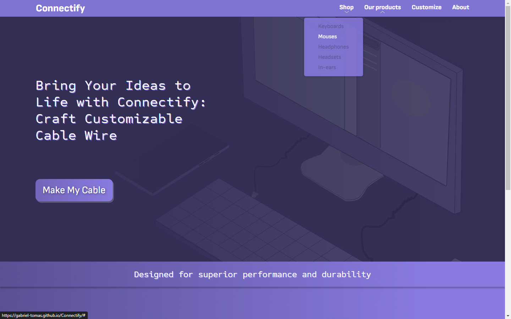
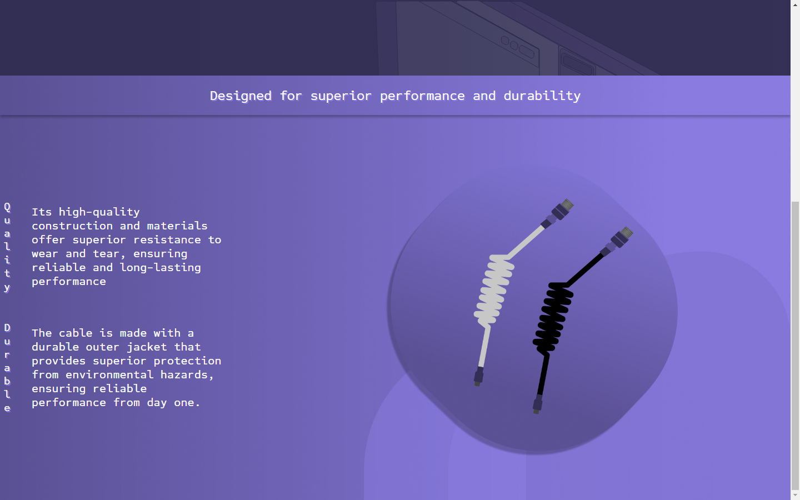
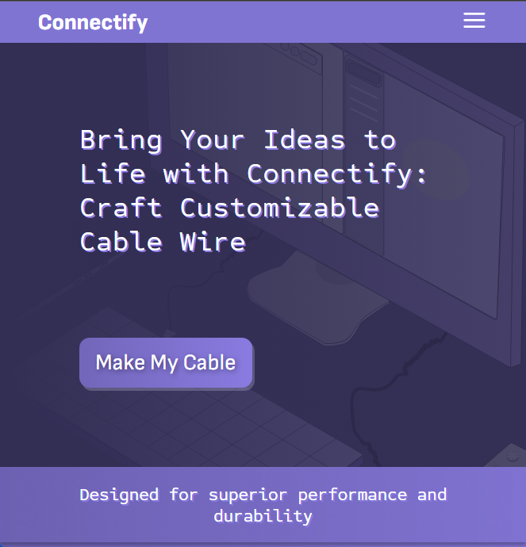
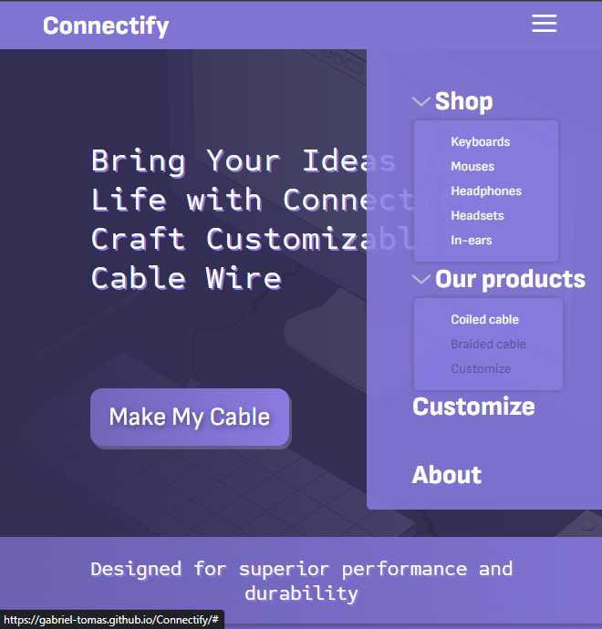
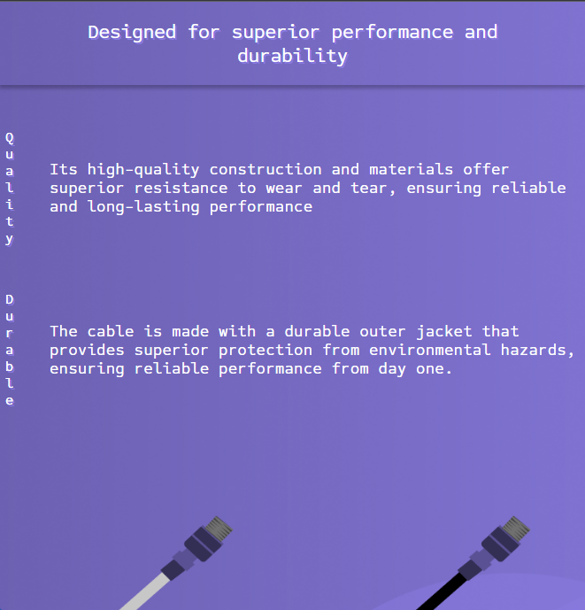
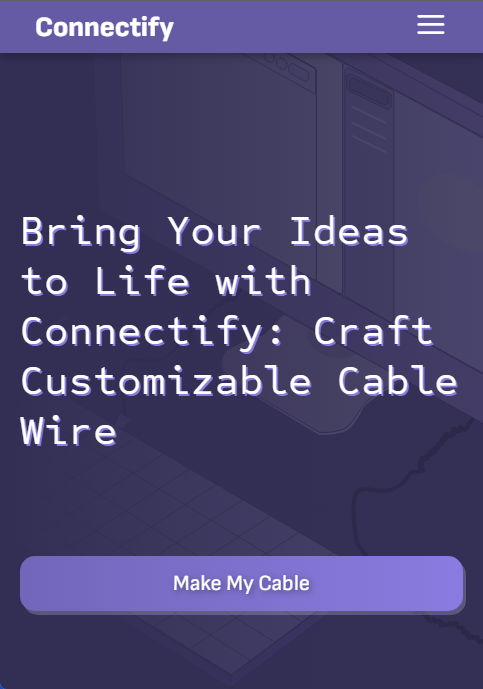
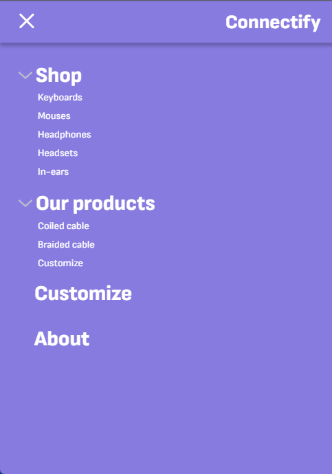
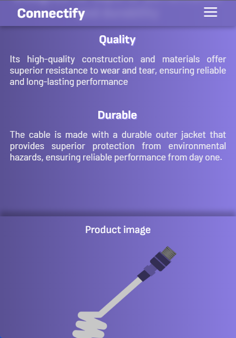

# Connectify
Site imaginário sobre uma loja de cabos customizáveis.

A intenção desse projeto é para práticar HTML e CSS.

## O que usei
Conceitos de background, como imagem de fundo, attachment, size, position, dropdown menus, media queries, transition.

[Wireframe do projeto](https://www.figma.com/file/RTWFYEmUZUOWINziZYCJBD/Connectify?node-id=0%3A1&t=oUnjY9P5SJk8orx3-0).

## Capturas de tela 

### Dispositivos grandes

### Dispositivos médios

### Dispositivos pequenos

